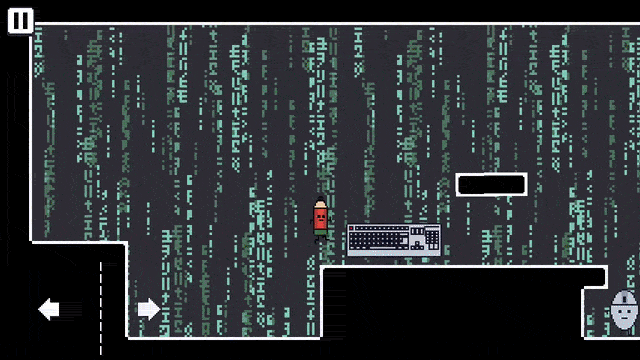

# ✏️ Pencil — 2D Platformer Game

  

> **Note:** As this game is scheduled for commercial publication on major storefronts (Steam, GOG, Google Play), the core source code is kept private. This repository serves as a technical and visual showcase of the project.

## 📌 Project Overview
**Pencil** is a family-friendly, non-violent 2D platformer (rated PEGI 3) developed entirely from scratch using the **Godot Engine**. Set in engaging school classroom environments with lesson-themed mechanics, the game is architected for a seamless multi-platform release.

---

## 🎨 End-to-End Product Ownership
Building a game entirely solo requires not just creativity, but strict software engineering principles and efficient resource management.

* **Zero Pre-Made Assets:** I designed and animated every pixel art sprite, tilemap, and UI element independently, showcasing a strong balance between technical execution and creative problem-solving.
* **Commercial Release Pipeline:** Structuring the build process, memory optimization, and deployment pipeline for an upcoming commercial release across PC and Mobile platforms.

  
  &nbsp;
  

---

## 🛠️ Multi-Platform Architecture & Mechanics
* **Unified Codebase:** Engineered the game logic to run efficiently across mobile (ARM) and PC (x86/x64) architectures without major refactoring.
* **Dynamic Input Handling:** Implemented a scalable input system that seamlessly switches between touch controls (Android/iOS) and keyboard/gamepad inputs (Windows).
* **Physics & State Management:** Programmed custom 2D kinematic physics for tight, lag-free platforming, utilizing state machines to manage player animations and interactive puzzle elements.

  
  &nbsp;
  

---

## 📬 Contact
* **Email:** [omerfaruk.kus@outlook.com](mailto:omerfaruk.kus@outlook.com)
* **LinkedIn:** [linkedin.com/in/omrfrkkus](https://linkedin.com/in/omrfrkkus)
